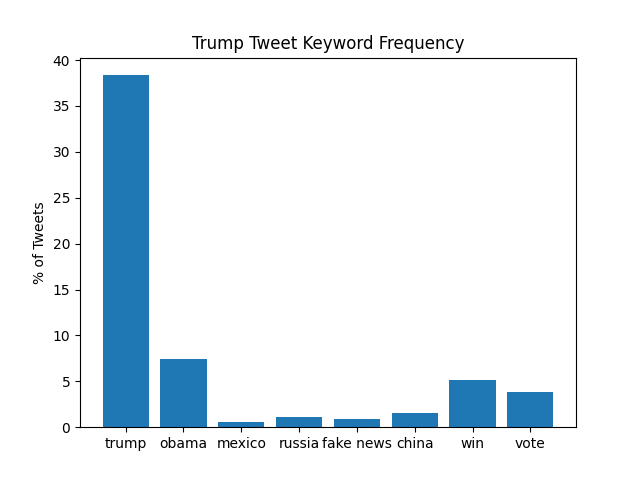
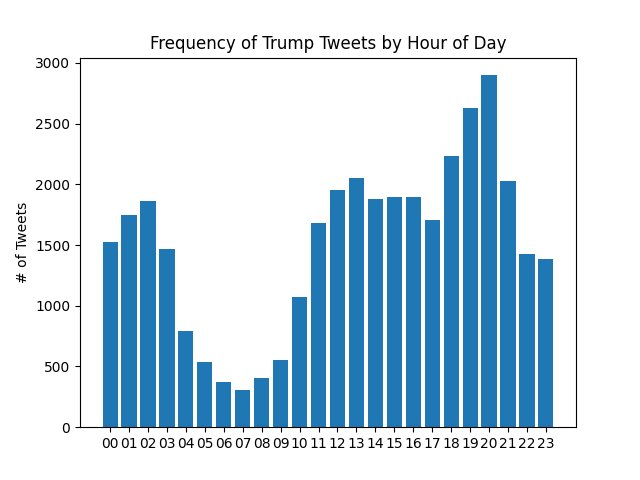

# Trump Twitter Lab Analysis

### 1. Tweet Frequency of Words
This table shows the frequency of certain words in Trump's tweets, extracted from the JSON archive.

| Keyword    |  Count | Percentage |
|------------|--------|------------|
| trump      |  13924 |     38.35% |
| obama      |   2712 |      7.47% |
| mexico     |    199 |      0.55% |
| russia     |    412 |      1.13% |
| fake news  |    333 |      0.92% |
| china      |    548 |      1.51% |
| win        |   1870 |      5.15% |
| vote       |   1401 |      3.86% |

---

The following bar chart shows the distribution of the frequency of keywords in Trump's tweets.

---

### 2. Extra Credit: Tweet Frequency by Hour
The following bar chart visualizes the peak hours of tweeting activity based on the dataset.

