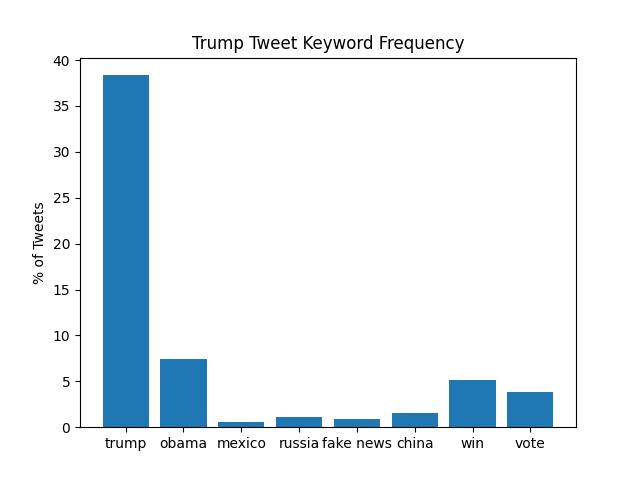
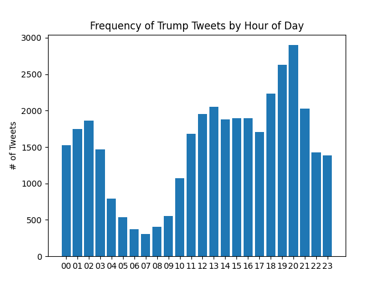
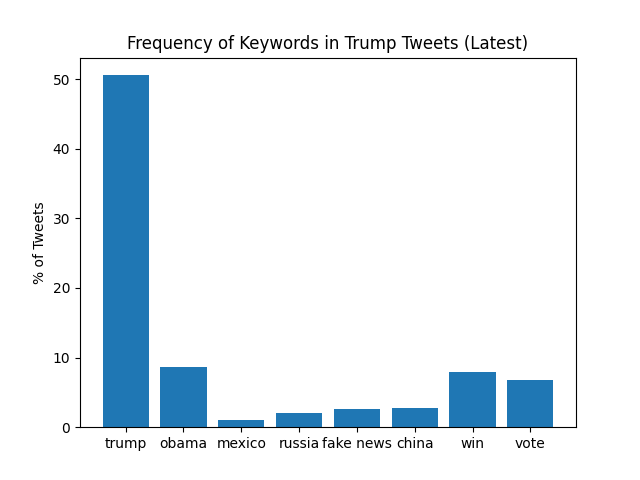
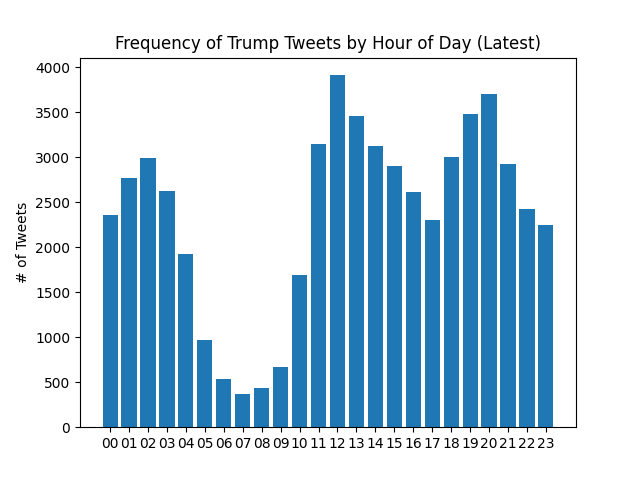

# Trump Twitter Lab Analysis

### 1. Tweet Frequency of Words and Tweets by Hour of Day
This table shows the frequency of certain words in Trump's tweets, extracted from the JSON archive.

| Keyword    |  Count | Percentage |
|------------|--------|------------|
| trump      |  13924 |     38.35% |
| obama      |   2712 |      7.47% |
| mexico     |    199 |      0.55% |
| russia     |    412 |      1.13% |
| fake news  |    333 |      0.92% |
| china      |    548 |      1.51% |
| win        |   1870 |      5.15% |
| vote       |   1401 |      3.86% |

The following bar chart shows the distribution of the frequency of keywords in Trump's tweets.

The following bar chart shows the frequency Trump's tweets by hour of day.

---

### 2. Extra Credit: Latest Trump Tweets
This table shows the frequency of certain words in Trump's latest tweets, extracted from a different JSON archive containing his latest tweets.

| Keyword    | Count2 | Percentage2 |
|------------|--------|------------|
| trump      |  18356 |     50.56% |
| obama      |   3117 |      8.59% |
| mexico     |    353 |      0.97% |
| russia     |    744 |      2.05% |
| fake news  |    940 |      2.59% |
| china      |   1027 |      2.83% |
| win        |   2878 |      7.93% |
| vote       |   2487 |      6.85% |

The following bar chart shows the distribution of the frequency of keywords in Trump's latest tweets.

The following bar chart shows the frequency Trump's latest tweets by hour of day.

